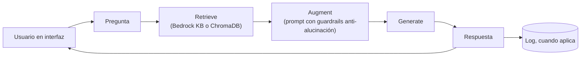
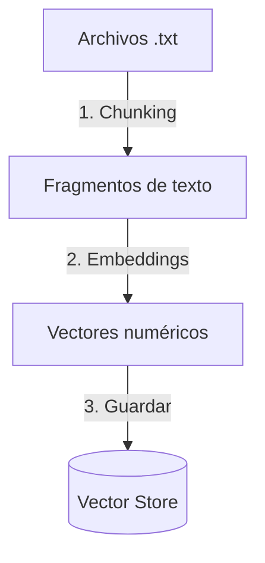
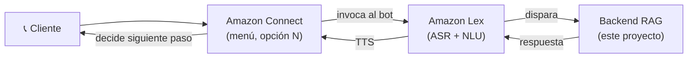

# 🚗 AutoSpec Voice Assistant — Asistente de Voz RAG para Consultas Automotrices

Asistente de Voz Conversacional (IVR Inteligente) que responde consultas técnicas sobre vehículos en tiempo real, a partir de fichas técnicas y manuales cargados en la nube. El proyecto usa una arquitectura **RAG (Retrieval-Augmented Generation)**, construida en fases progresivas para maximizar aprendizaje técnico, resiliencia de infraestructura y preparación para el examen **AWS Certified AI Practitioner**.

| Respuesta exitosa de la Lambda | Knowledge Base disponible |
|---|---|
|  |  |

---

## 💡 Motivación

Este proyecto nace de la curiosidad de entender qué ocurre **dentro** de un pipeline RAG, en vez de usarlo como una caja negra. Por eso está diseñado como una evolución deliberada:

1. **Aislar la recuperación pura** (Fase 1), usando Bedrock Knowledge Bases gestionado, para validar que los cimientos —ingesta, chunking, embeddings, búsqueda vectorial— funcionan correctamente *antes* de sumar generación de texto.
2. **Construir el ciclo RAG completo a mano** (Fase 2), con Titan Embeddings y Amazon Nova Lite orquestados directamente en código (boto3 + ChromaDB), para ver y controlar cada paso del proceso, en vez de depender de la abstracción automática de una Knowledge Base gestionada.
3. **Reconstruir esa misma orquestación con un framework profesional** (Fase 3), usando LangChain y Google Gemini, para demostrar que la arquitectura es portátil entre proveedores (no depende de AWS) y que un framework estándar simplifica el intercambio de proveedor a solo un par de líneas de código.

El dominio automotriz se eligió por ser un caso de uso realista y frecuente para asistentes de voz conversacionales (IVR) en industria.

---

## 🗺️ Mapa de Progreso

| Fase | Estado | Detalle |
|---|---|---|
| **Fase 1 — Retrieval Directo (Sin LLM)** | ✅ Completada | Búsqueda vectorial pura sobre Bedrock Knowledge Base gestionada, para validar los datos y aislar fallos. Costo $0 en generación. |
| **Fase 2 — RAG con AWS (Titan Embeddings + Nova Lite)** | ✅ Completada | Ciclo RAG completo orquestado en código con ChromaDB, Amazon Titan Embeddings V2 y Amazon Nova Lite (Converse API), con guardrail anti-alucinación. |
| **Fase 3 — RAG Code-First (LangChain + Gemini)** | ✅ Completada | Mismo patrón RAG reconstruido con LangChain, usando embeddings y generación de Google Gemini, con logging de conversaciones en SQLite. |
| **Fase 4 — Canal de Voz (Amazon Connect + Lex)** | 🔭 Visión futura | Conectar el backend validado a un canal telefónico real. No iniciada. |

---

## 🏗️ Arquitectura

### Flujo actual validado: pipeline RAG completo (Fases 1-3)



### Flujo offline (ingesta, se ejecuta una sola vez por documento nuevo)



> **Nota conceptual:** en Fase 1, esto lo hace la Knowledge Base de Bedrock de forma automática. En Fases 2 y 3, este mismo flujo se controla explícitamente en código.

### Visión futura del producto (Fase 4 — diseño, no implementada aún)



---

## 🛠️ Stack Tecnológico

| Componente | Servicio | Fase |
|---|---|---|
| Almacenamiento de documentos | Amazon S3 | Fase 1 |
| Orquestador de conocimiento gestionado | Amazon Bedrock Knowledge Bases | Fase 1 |
| Cómputo / lógica | AWS Lambda (Python, boto3) | Fase 1 |
| Vector store en código | ChromaDB | Fases 2 y 3 |
| Embeddings | Amazon Titan Text Embeddings V2 | Fase 2 |
| Generación | Amazon Nova Lite (Converse API) | Fase 2 |
| Framework de orquestación | LangChain (LCEL) | Fase 3 |
| Embeddings + Generación | Google Gemini (`gemini-embedding-001`, `gemini-3.6-flash`) | Fase 3 |
| Registro de conversaciones | SQLite | Fase 3 |
| Interfaz de prueba | Streamlit | Fases 2 y 3 |
| Voz (visión futura) | Amazon Lex + Amazon Connect | Fase 4 |

---

## 📁 Estructura del Repositorio

```text
autospec-voice-assistant-rag/
├── README.md
├── .gitignore
├── docs/
│   └── screenshots/
│       ├── fase1/
│       ├── fase2/
│       ├── fase3/
│       └── fase4/
├── fase1-retrieval-directo/
│   ├── lambda_function.py
│   ├── test_event.json
│   └── README.md
├── fase2-rag-gestionado/
│   ├── populate_autospec.py
│   ├── rag_lib.py
│   ├── rag_app.py
│   └── README.md
└── fase3-rag-code-first/
    ├── ingest.py
    ├── rag_chain.py
    ├── app.py
    └── README.md
```

---

## 🚀 Fase 1: Retrieval Directo (Sin LLM) — ✅ Completada

Búsqueda vectorial pura sobre la Knowledge Base gestionada de Bedrock. **Resultado:** `200 OK`, 3 fragmentos recuperados, mejor score `0.59`, costo `$0.00`.

Detalle completo en [`fase1-retrieval-directo/`](./fase1-retrieval-directo/README.md).

---

## ⚙️ Fase 2: RAG con AWS (Titan + Nova Lite) — ✅ Completada

Ciclo RAG completo orquestado directamente en código: ChromaDB como vector store, Amazon Titan Embeddings V2, y Amazon Nova Lite generando la respuesta, con guardrail anti-alucinación validado.

Detalle completo en [`fase2-rag-gestionado/`](./fase2-rag-gestionado/README.md).

---

## 🧩 Fase 3: RAG Code-First (LangChain + Gemini) — ✅ Completada

El mismo patrón RAG, reconstruido con LangChain para demostrar portabilidad entre proveedores: embeddings y generación con Google Gemini, logging de conversaciones en SQLite.

Detalle completo en [`fase3-rag-code-first/`](./fase3-rag-code-first/README.md).

---

## 🔮 Próximos Pasos

- **Fase 4:** conectar el backend validado a Amazon Connect + Lex para un canal de voz real.

---

## 📄 Nota

Proyecto personal de aprendizaje, construido para profundizar en arquitecturas RAG y como preparación para el examen **AWS Certified AI Practitioner**.