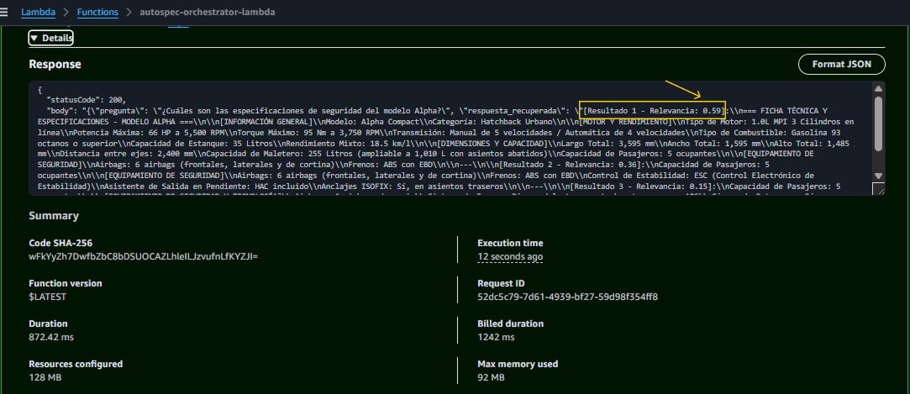
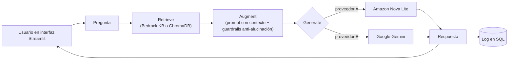
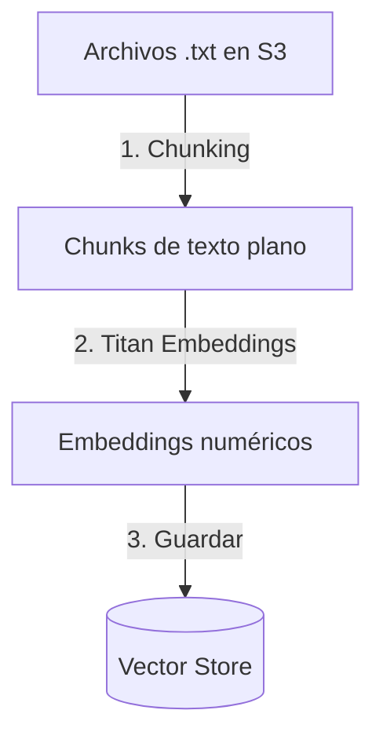
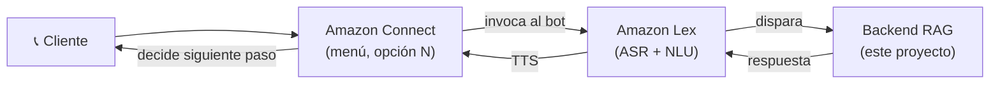

# 🚗 AutoSpec Voice Assistant — Asistente de Voz RAG para Consultas Automotrices

Asistente de Voz Conversacional (IVR Inteligente) que responde consultas técnicas sobre vehículos en tiempo real, a partir de fichas técnicas y manuales cargados en la nube. El proyecto usa una arquitectura **RAG (Retrieval-Augmented Generation)**, construida en fases progresivas para maximizar aprendizaje técnico, resiliencia de infraestructura y preparación para el examen **AWS Certified AI Practitioner**.

| Respuesta exitosa de la Lambda                                               | Knowledge Base disponible                                            |
| ---------------------------------------------------------------------------- | -------------------------------------------------------------------- |
|  |  |

---

## Motivación

Este proyecto nace de la curiosidad de entender qué ocurre **dentro** de un pipeline RAG gestionado como Bedrock Knowledge Bases, en vez de usarlo como una caja negra. Por eso está diseñado como una evolución deliberada:

1. **Aislar la recuperación pura** (Fase 1), para validar que los cimientos —ingesta, chunking, embeddings, búsqueda vectorial— funcionan correctamente _antes_ de sumar generación de texto encima.
2. **Conectar un LLM gestionado** (Fase 2), para completar el ciclo RAG usando la abstracción que ofrece AWS.
3. **Reconstruir la orquestación en código** (Fase 3), con un vector store propio y generación intercambiable entre proveedores, para entender qué automatiza un servicio gestionado por debajo y no depender de uno solo.

> **Nota de transparencia:** durante la Fase 2, el entorno de prueba disponible tenía restringido el permiso `s3:CreateBucket`, lo que impidió crear una Knowledge Base gestionada. En vez de forzar esa restricción, se adelantó la Fase 3 con una implementación completa y funcional (retrieval con ChromaDB, generación intercambiable entre Amazon Nova Lite y Google Gemini). Fase 2 queda documentada como pendiente, a completar en un entorno con permisos completos. Detalle técnico en [`fase2-rag-gestionado/README.md`](./fase2-rag-gestionado/README.md).

El dominio automotriz se eligió por ser un caso de uso realista y frecuente para asistentes de voz conversacionales (IVR) en industria.

---

## Mapa de Progreso

| Fase                                                                            | Estado           | Detalle                                                                                                                  |
| ------------------------------------------------------------------------------- | ---------------- | ------------------------------------------------------------------------------------------------------------------------ | -------- |
| **Fase 1 — Retrieval Directo (Sin LLM)**                                        | ✅ Completada    | Búsqueda vectorial pura para validar los datos y aislar fallos. Costo $0 en generación.                                  |
| **Fase 2 — RAG Gestionado (Bedrock Managed KB)**                                | ✅ Completada    | RAG completo usando Amazon Titan Embeddings V2 en Chroma y generación con Amazon Nova Lite + Guardrail anti-alucinación. | detalle. |
| **Fase 3 — RAG Code-First (Vector store en código + proveedor intercambiable)** | ✅ Completada    | ChromaDB + Titan Embeddings, generación con Amazon Nova Lite o Google Gemini, logging en SQL, interfaz Streamlit.        |
| **Fase 4 — Canal de Voz (Amazon Connect + Lex)**                                | 🔭 Visión futura | Conectar el backend validado a un canal telefónico real. No iniciada.                                                    |

---

## Arquitectura

### Flujo actual validado: pipeline RAG completo (Fases 1-3)

Esto es lo que realmente está construido y probado hoy — una interfaz de chat (no telefónica todavía) que ejecuta el ciclo completo Retrieve + Augment + Generate, con el motor de generación intercambiable entre proveedores.



### Flujo offline (ingesta, se ejecuta una sola vez por documento nuevo)



> **Nota conceptual:** la _Knowledge Base_ es el orquestador completo (S3 + chunking + Titan Embeddings + Vector Store). El _Vector Store_ es únicamente donde se guardan los vectores.

### Visión futura del producto (Fase 4 — diseño, no implementada aún)

En la versión final del producto, este pipeline se conectaría a un canal telefónico real. Amazon Connect actuaría como orquestador maestro del IVR, invocando a un bot de Lex (ASR/NLU) que a su vez dispararía este mismo backend, devolviendo el control a Connect al finalizar la conversación.



---

## Stack Tecnológico

| Componente                           | Servicio                           | Uso                                                                            |
| ------------------------------------ | ---------------------------------- | ------------------------------------------------------------------------------ |
| Almacenamiento de documentos         | Amazon S3                          | Fichas técnicas en `.txt` (UTF-8) — Fase 1                                     |
| Orquestador de conocimiento (Fase 1) | Amazon Bedrock Knowledge Bases     | Chunking + indexación + búsqueda por similitud                                 |
| Vector store en código (Fase 3)      | ChromaDB                           | Almacén vectorial local, alternativa sin dependencia de un servicio gestionado |
| Embeddings                           | Amazon Titan Text Embeddings V2    | Convierte texto en vectores numéricos                                          |
| Generación — opción A                | Amazon Nova Lite                   | Redacta la respuesta conversacional                                            |
| Generación — opción B                | Google Gemini (`gemini-3.6-flash`) | Proveedor alternativo, intercambiable sin tocar el resto del pipeline          |
| Registro de conversaciones           | SQLite                             | Auditoría de preguntas, respuestas y fragmentos recuperados                    |
| Interfaz de prueba                   | Streamlit                          | UI de chat para validar el pipeline end-to-end                                 |
| Cómputo / lógica (Fase 1)            | AWS Lambda (Python 3.x, boto3)     | Recibe la pregunta, consulta la KB, formatea la respuesta                      |
| Voz (visión futura)                  | Amazon Lex + Amazon Connect        | ASR, TTS y canal telefónico — Fase 4                                           |

---

## Estructura del Repositorio

```text
autospec-voice-assistant-rag/
├── README.md
├── .gitignore
├── docs/
│   └── screenshots/
│       ├── fase1/
│       ├── fase3/
│       └── fase4/
├── fase1-retrieval-directo/
│   ├── lambda_function.py
│   ├── test_event.json
│   └── README.md
├── fase2-rag-gestionado/
│   └── README.md
└── fase3-rag-code-first/
    ├── populate_autospec.py
    ├── rag_app.py
    ├── rag_lib.py
    └── README.md
```

---

## Fase 1: Retrieval Directo (Sin LLM) - ✅ Validada

Búsqueda vectorial pura sobre la Knowledge Base (`FZTIBQAOEW`), sin invocar ningún LLM.

**Resultado:** `200 OK` — 3 fragmentos recuperados, mejor score `0.59`, costo `$0.00` en generación.

Detalle completo en [`fase1-retrieval-directo/`](./fase1-retrieval-directo/README.md).

---

## Fase 2: RAG Gestionado (Bedrock Managed KB) - ✅ Completada

Implementación y validación del pipeline RAG usando Amazon Titan Text Embeddings V2 en ChromaDB y Amazon Nova Lite vía la API Converse de Bedrock, incluyendo un guardrail estricto contra alucinaciones.

Detalle completo, incluyendo el diagnóstico exacto del bloqueo, en [`fase2-rag-gestionado/`](./fase2-rag-gestionado/).

---

## Fase 3: RAG Code-First - ✅ Completada

Vector store en código con ChromaDB, generación intercambiable entre Amazon Nova Lite y Google Gemini, logging de conversaciones en SQL, e interfaz de prueba con Streamlit.

Detalle completo, código y evidencia en [`fase3-rag-code-first/`](./fase3-rag-code-first/README.md).

---

## Próximos Pasos

- **Completar Fase 2** en un entorno con permisos completos (cuenta personal con acceso a modelos, u otro sandbox sin restricciones de S3).
- **Fase 4:** conectar el backend validado a Amazon Connect + Lex para un canal de voz real.

---
