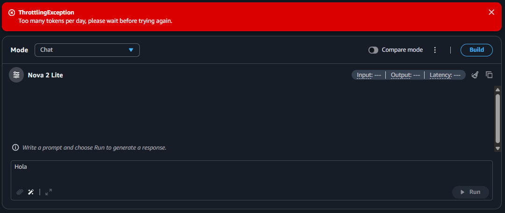

## Fase 2: RAG con AWS a Mano (Titan + ChromaDB + Nova Lite)

⬅️ [Volver al README principal](../README.md)

## Estado: ✅ Completada

Ciclo RAG completo usando Amazon Titan Text Embeddings V2 para la búsqueda vectorial y Amazon Nova Lite para la generación de la respuesta final, con un guardrail anti-alucinación validado.

## Contexto y Obstáculos Superados en AWS

Esta fase se construyó manualmente para sortear tres restricciones reales encontradas en AWS:

1. **Permiso `s3:CreateBucket` bloqueado:** En entornos de prueba (AWS Skill Builder) no era posible crear buckets automáticos para nuevas Knowledge Bases.
2. **`RetrieveAndGenerate` no soportado:** Las Managed Knowledge Bases en cuentas con créditos limitaban las operaciones a `retrieve` puro. La generación tuvo que orquestarse manualmente invocando `converse()`.
3. **Throttling por cuota diaria de tokens:** Bloqueos por `ThrottlingException` en la API de Converse obligaron a desacoplar la base vectorial a un almacenamiento local accesible y sin límites de consulta (`ChromaDB`).

   

## Archivos

- `populate_autospec.py` — genera embeddings de las 3 fichas técnicas y las guarda en una colección Chroma.
- `rag_lib.py` — lógica de retrieval (Chroma) + armado del prompt + generación con Nova Lite (Converse API).
- `rag_app.py` — interfaz de chat con Streamlit.

## Cómo probarlo

1. Instalar dependencias:

```bash
   pip install boto3 chromadb streamlit
```

2. Generar la colección de embeddings (una sola vez):

```bash
   python populate_autospec.py
```

Resultado esperado: `Colección lista con 3 documentos`

3. Levantar la interfaz:

```bash
   streamlit run rag_app.py
```

4. Probar con una pregunta real:

   > ¿Cuáles son las especificaciones de seguridad del modelo Alpha?

5. Probar con una pregunta sin respuesta en los datos (validación anti-alucinación):

   > ¿Cuál es la garantía extendida del modelo Alpha?

   Resultado esperado: _"No tengo esa información en las fichas técnicas disponibles."_

## Evidencia

**1. Ingesta completada:**


**2. Pregunta real (modelo Alpha):**


**3. Pregunta sin respuesta en los datos (guardrail anti-alucinación):**


## Guardrail anti-alucinación

El prompt instruye explícitamente al modelo a:

- Usar solo el fragmento del modelo de vehículo mencionado en la pregunta, ignorando fragmentos de otros modelos aunque estén en el contexto recuperado.
- Responder con un mensaje fijo cuando la información no esté disponible, en vez de inventar datos.

## Nota técnica

Con solo 3 documentos en la colección, la búsqueda vectorial (`n_results=3`) siempre devuelve los 3 fragmentos completos, sin importar la pregunta; el filtro real de "solo el modelo correcto" lo aplica el LLM al redactar, gracias a la instrucción del prompt. Con un corpus más grande, el retrieval mismo traería solo los fragmentos relevantes.
