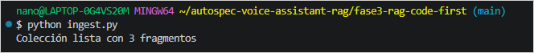
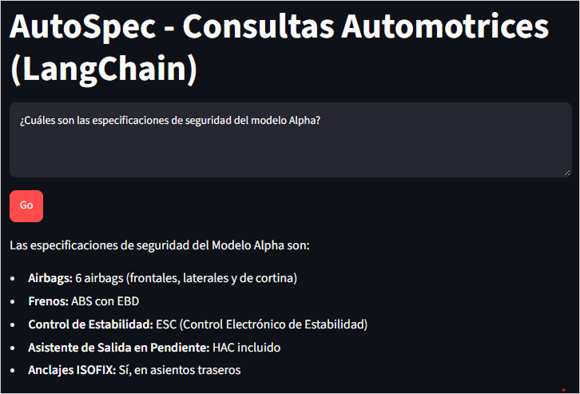
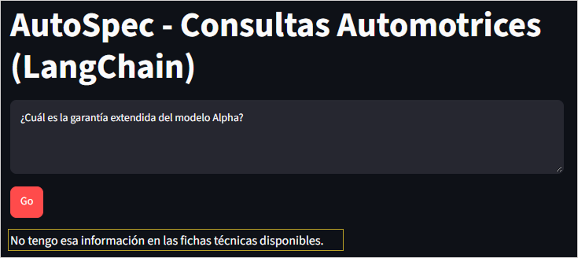
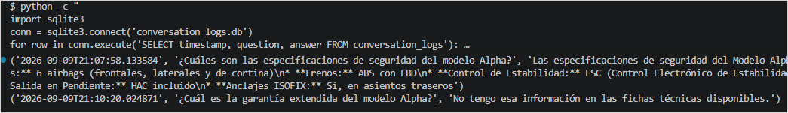

# Fase 3 - RAG "Code-First" con LangChain

⬅️ [Volver al README principal](../README.md)

## Estado: ✅ Completada

## Archivos

- `ingest.py` — fragmenta los documentos, genera embeddings con Gemini y los guarda en Chroma.
- `rag_chain.py` — cadena RAG completa con LangChain (retriever + prompt + LLM), más logging en SQLite.
- `app.py` — interfaz de chat con Streamlit.

## Cómo probarlo

```bash
pip install -r requirements.txt
export GEMINI_API_KEY="tu-clave-real"
python ingest.py
streamlit run app.py
```

## Evidencia

**1. Ingesta completada:**

📸 _[CAPTURA: terminal mostrando "Colección lista con N fragmentos"]_



**2. Pregunta real (modelo Alpha):**

📸 _[CAPTURA: interfaz con la pregunta y la respuesta correcta]_



**3. Pregunta sin respuesta en los datos (validación anti-alucinación):**

📸 _[CAPTURA: interfaz mostrando "No tengo esa información..."]_



**4. Verificación del logging en SQLite:**

```bash
python3 -c "
import sqlite3
conn = sqlite3.connect('conversation_logs.db')
for row in conn.execute('SELECT timestamp, question, answer FROM conversation_logs'):
    print(row)
"
```

📸 _[CAPTURA: terminal con las filas guardadas]_



## Comparación con Fase 2

|                     | Fase 2                                          | Fase 3                                  |
| ------------------- | ----------------------------------------------- | --------------------------------------- |
| Orquestación        | Llamadas manuales (`boto3`, `chromadb` directo) | Cadena declarativa con LangChain (LCEL) |
| Cambio de proveedor | Reescribir función con `if/else`                | Cambiar 2 líneas de configuración       |
| Embeddings          | Titan (AWS)                                     | Gemini                                  |
| Generación          | Nova Lite (AWS)                                 | Gemini                                  |
