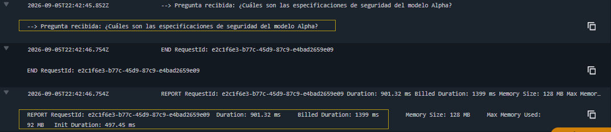
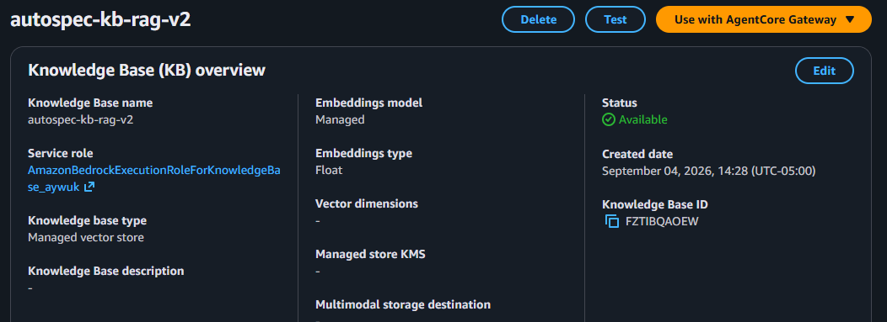
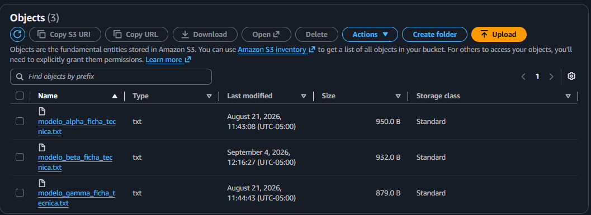

# Fase 1: Direct Retrieval (Bedrock Knowledge Base)

⬅️ [Volver al README principal](../README.md)

## Estado: ✅ Completada

Búsqueda vectorial pura sobre la Knowledge Base de Bedrock, sin invocar ningún modelo generativo. El objetivo es validar que la ingesta (S3 → chunking → embeddings → Vector Store) funciona correctamente antes de sumar un LLM encima.

## Archivos

- `lambda_function.py` — código de la función Lambda `autospec-orchestrator-lambda`.
- `test_event.json` — evento de prueba usado en la consola de Lambda.

## Configuración usada

| Recurso              | Valor                                                                       |
| -------------------- | --------------------------------------------------------------------------- |
| Bucket S3            | `autospec-knowledge-base-data` (us-east-1)                                  |
| Knowledge Base       | `autospec-kb-rag-v2` — ID `FZTIBQAOEW`                                      |
| Data Source          | `autospec-s3-datasource` → `s3://autospec-knowledge-base-data/`             |
| Modelo de embeddings | Amazon Titan Text Embeddings V2                                             |
| Permisos IAM         | Política `AmazonBedrockFullAccess` adjunta al rol de ejecución de la Lambda |

## Cómo probarlo

1. Abrir la función Lambda en la consola de AWS.
2. Pegar el siguiente evento como Test Event (o usar directamente el archivo `test_event.json`):

```json
{
  "prompt": "¿Cuáles son las especificaciones de seguridad del modelo Alpha?"
}
```

3. Ejecutar el test.

## Resultado obtenido

| Métrica                | Valor                                                               |
| ---------------------- | ------------------------------------------------------------------- |
| Código HTTP            | `200 OK`                                                            |
| Fragmentos recuperados | 3, ordenados por similitud vectorial                                |
| Mejor resultado        | Modelo Alpha — score `0.59` — sección `[EQUIPAMIENTO DE SEGURIDAD]` |
| Costo de generación    | `$0.00` (solo Retrieval, sin LLM)                                   |

```json
{
  "statusCode": 200,
  "body": "{\"pregunta\": \"...\", \"respuesta_recuperada\": \"[Resultado 1 - Relevancia: 0.59]:\\n...\"}"
}
```

## Evidencia

**Respuesta de la Lambda (200 OK, 3 fragmentos y el score de relevancia de la búsqueda vectorial (0.59)):**


**Logs de CloudWatch (traza de ejecución):**



**Knowledge Base disponible (overview):**



**Objetos cargados en el bucket S3:**



---
